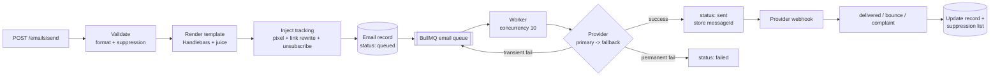

# email-service-nodejs

A transactional email service with multi-provider support, template management,
open/click tracking, bounce & complaint handling, suppression management, and
delivery analytics.

Built with **NestJS 10 · TypeScript 5 · Prisma (PostgreSQL) · Redis · BullMQ ·
SendGrid · AWS SES · Nodemailer (SMTP) · Handlebars · juice · Docker**.

---

## Pipeline



---

## Architecture

- **Provider strategy pattern.** Every send goes `EmailService -> queue -> ProviderRegistry -> provider`. Nothing calls a provider directly. `ProviderRegistry.sendWithFallback()` tries the primary provider and, on a *transient* failure, the configured fallback. Permanent failures (bad address, 4xx) are not retried or failed-over.
- **Two processes.** `main.ts` is the HTTP API; `worker.ts` runs the BullMQ processors. They share Redis + Postgres. Scale workers horizontally.
- **Queues.** `email` (concurrency 10), `batch` (chunks of 50), `notification` (admin alerts).

| Provider | Client | Rate limit | Permanent-failure signal |
|---|---|---|---|
| SendGrid | `@sendgrid/mail` | 600/min | HTTP 4xx |
| AWS SES  | `@aws-sdk/client-sesv2` | 14/sec | `MessageRejected`, unverified domain |
| SMTP     | `nodemailer` | n/a (server-dependent) | 5xx SMTP reply |

---

## Tracking

- **Opens** — a 1×1 transparent GIF (`/api/v1/tracking/open/:trackingId`) is injected before `</body>`. First open sets `openedAt`; every open increments `openedCount`. Known bot/prefetch user-agents are filtered so proxies don't inflate rates.
- **Clicks** — every `<a href>` is rewritten to `/api/v1/tracking/click/:trackingId?url=<encoded>`. The endpoint records the click and 302-redirects to the original URL. Anchors, `mailto:`, and `tel:` links are left untouched.

---

## Bounce, complaint & unsubscribe

- **Hard bounce** → added to the suppression list immediately (never retried).
- **Soft bounce** → retried up to 3 times, then suppressed.
- **Complaint** → suppressed as `complaint`; if the complaint rate crosses **0.1%**, a `complaint-rate-alert` job is queued for the admin.
- **Unsubscribe** — every email carries a `List-Unsubscribe` header + a one-click link. The token is a JWT (1-year expiry) holding the recipient address. `POST /api/v1/unsubscribe/:token` suppresses the address.
- Every send checks the suppression list first and is rejected if the recipient is suppressed.

### Webhook setup

- **SendGrid** — point the Event Webhook at `POST /api/v1/webhooks/sendgrid`. It posts an array of events (delivered / bounce / dropped / spamreport).
- **AWS SES** — subscribe an SNS topic (Bounce / Complaint / Delivery) to `POST /api/v1/webhooks/ses`. The handler parses the SNS `Message` payload.

---

## API reference

| Method | Path | Purpose |
|---|---|---|
| POST | `/api/v1/emails/send` | Send a single email (raw body or template) |
| POST | `/api/v1/emails/batch` | Batch send (≤10,000 recipients) |
| POST | `/api/v1/emails/schedule` | Schedule an email (`scheduledAt`) |
| GET | `/api/v1/emails/scheduled` | List scheduled emails |
| GET | `/api/v1/emails` | List emails (filter by `status`) |
| GET | `/api/v1/emails/:id` | Delivery status + tracking events |
| DELETE | `/api/v1/emails/:id` | Cancel a scheduled email |
| POST | `/api/v1/templates` | Create template |
| GET | `/api/v1/templates` | List templates |
| GET/PUT/DELETE | `/api/v1/templates/:id` | Get / update / delete |
| POST | `/api/v1/templates/:id/preview` | Render with sample data |
| POST | `/api/v1/templates/:id/test` | Send a test email |
| GET | `/api/v1/tracking/open/:trackingId` | Open pixel (1×1 GIF) |
| GET | `/api/v1/tracking/click/:trackingId` | Click redirect (302) |
| POST | `/api/v1/webhooks/sendgrid` | SendGrid events |
| POST | `/api/v1/webhooks/ses` | SES/SNS notifications |
| GET | `/api/v1/analytics` | Overall stats |
| GET | `/api/v1/analytics/timeseries` | Daily time series |
| GET | `/api/v1/analytics/template/:id` | Per-template stats |
| GET | `/api/v1/analytics/export` | CSV export |
| GET/POST | `/api/v1/suppression` | List / add suppression entries |
| DELETE | `/api/v1/suppression/:email` | Remove from suppression |
| POST | `/api/v1/unsubscribe/:token` | One-click unsubscribe |

### Send example

```bash
# Raw body
curl -X POST localhost:3000/api/v1/emails/send -H 'Content-Type: application/json' -d '{
  "to": "user@example.com",
  "subject": "Hello",
  "body": "<p>Hi there</p>"
}'

# Template
curl -X POST localhost:3000/api/v1/emails/send -H 'Content-Type: application/json' -d '{
  "to": "user@example.com",
  "templateId": "<uuid>",
  "variables": { "firstName": "Sam", "companyName": "Acme", "ctaUrl": "https://acme.com" }
}'
```

---

## Environment variables

See [`.env.example`](.env.example). Key ones:

| Var | Meaning |
|---|---|
| `DATABASE_URL` | Postgres connection string |
| `REDIS_HOST` / `REDIS_PORT` | Redis for BullMQ |
| `PRIMARY_PROVIDER` / `FALLBACK_PROVIDER` | `smtp` \| `sendgrid` \| `ses` |
| `SENDGRID_API_KEY` | SendGrid key |
| `AWS_REGION` / `AWS_ACCESS_KEY_ID` / `AWS_SECRET_ACCESS_KEY` | SES creds |
| `SMTP_HOST` / `SMTP_PORT` / `SMTP_USER` / `SMTP_PASS` | SMTP (defaults to MailHog) |
| `API_BASE_URL` | Public base URL used in tracking/unsubscribe links |
| `JWT_SECRET` | Signs unsubscribe tokens |
| `SENDGRID_RATE_PER_MIN` / `SES_RATE_PER_SEC` | Provider rate limits |

---

## Running

> Requires Docker. `npm install` is **not** run here — install locally when you're ready.

```bash
cp .env.example .env

# Everything (api + worker + postgres + redis + mailhog)
docker compose up --build

# Local dev (after npm install)
npm install
npx prisma migrate dev
npm run start:dev      # API
npm run worker:dev     # worker (separate terminal)
```

MailHog UI captures all outbound SMTP mail at http://localhost:8025.

---

## Testing

Unit tests cover the pure pieces — template rendering, link rewriting, tracking
pixel injection, and email validation.

```bash
npm test
```

---

## Rate limits

BullMQ's per-queue rate limiter enforces provider caps. Configure via
`SENDGRID_RATE_PER_MIN` (600) and `SES_RATE_PER_SEC` (14). Batch sends are
chunked (50/job) and counters are updated atomically in Redis.
